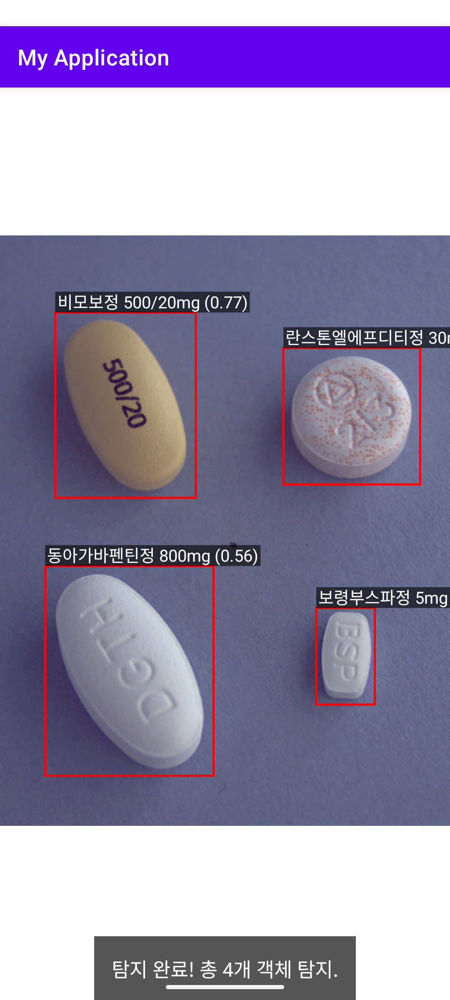

# Android YOLOv8n Object Detection POC

**Ultralytics YOLOv8n** 모델을 **TFLite** 형식으로 변환하여 **실제 Android 기기**에서 실시간 객체 탐지(Object Detection)가 성공적으로 작동함을 입증하는 **Proof of Concept (POC)**

* **모델:** YOLOv8n (경량화 모델)
* **플랫폼:** Android (Kotlin)
* **프레임워크:** TensorFlow Lite (TFLite)
* **핵심 기능:** 이미지 리사이징, `[0, 1]` 정규화 전처리, TFLite 추론, NMS(Non-Maximum Suppression) 후처리, 그리고 `fitCenter` 스케일링을 통한 정확한 바운딩 박스 시각화 구현.

### 🖼️ 탐지 결과 예시

